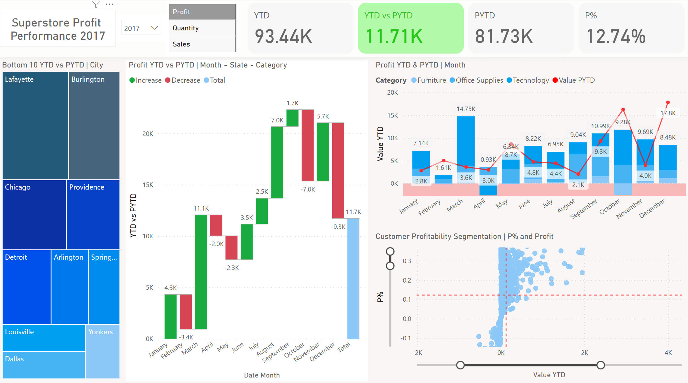

# Superstore Dashboard

This project focuses on data visualization to compare Profit, Quantity and Sales metrics from year to year using the formula Year to Date vs Prior Year to Date.

[Super Store Dataset](https://public.tableau.com/app/learn/sample-data)

## File yang Tersedia 

- `script_DataLoading.ipynb`: Data loading to view info, missing values, duplicates in the dataset.
- `Superstore_Dashboard.pbix`: Power BI dashboard to view required metrics and analyze performance.
- `sample_-_superstore.xls`: Raw data files of the dataset.
- `df_cleaned.xls`: Data has been cleaned.
- `README.md`: Explanation of this project.

## Libraries 
- Pandas
- Matplotlib

## Author ✍️
**Ade Indra Rukmana**

[LinkedIn](https://www.linkedin.com/in/ade-indra-rukmana/)